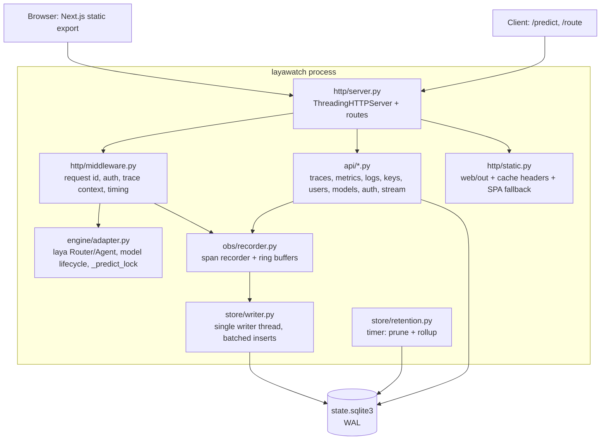
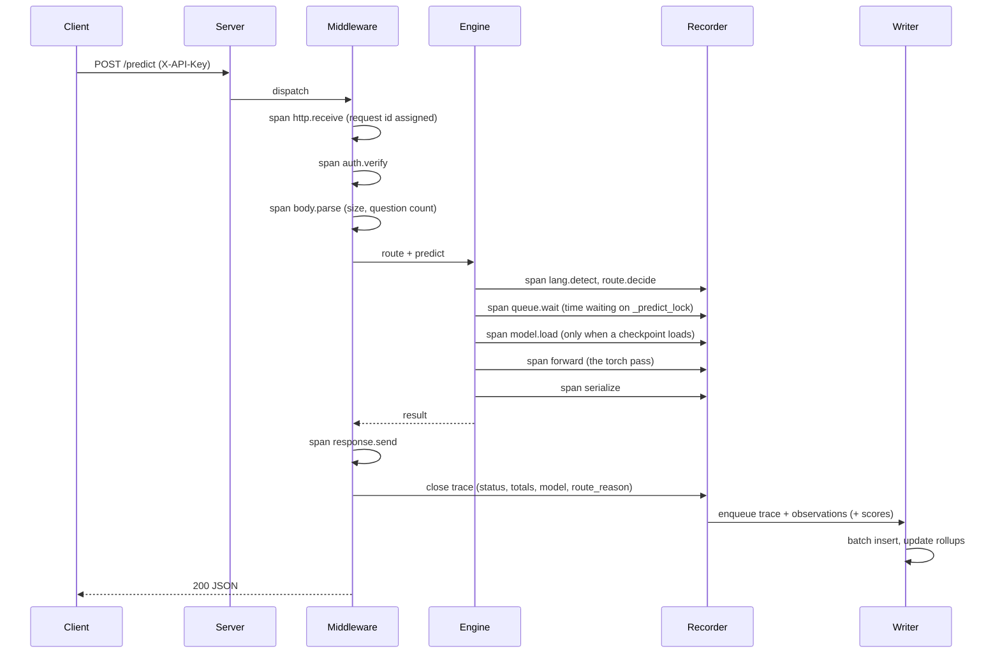
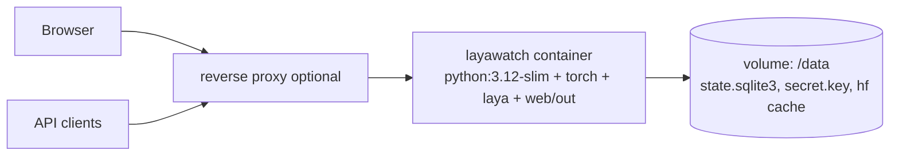

# LayaWatch architecture

Version: 0.1 (2026-09-22)

## 1. Shape of the system

LayaWatch is **one Python process** that does four jobs:

1. serves the engine API (`/predict`, `/route`) exactly as `serve.py` does today,
2. records every request as a trace with spans,
3. serves the console UI and its JSON API,
4. persists everything to a single SQLite file.

There is no message broker, no separate frontend server, no Node at runtime and no added Python
dependency. The engine (`laya`, torch CPU) is imported in-process.



## 2. Module layout

```
layawatch/
  __main__.py          entrypoint: parse env, build app, serve
  config.py            typed env config, defaults, validation, single source of truth
  log.py               structured log lines, level filter, ring buffer sink
  http/
    server.py          ThreadingHTTPServer, connection handling, graceful shutdown
    router.py          path -> handler table, method dispatch, 404/405
    middleware.py      request id, body limits, auth gates, timing, error envelope
    static.py          serves web/out, content types, ETag, immutable asset cache
    sse.py             chunked event stream, heartbeat, client registry
  obs/
    recorder.py        span context, timers, trace assembly, in-memory rings
    vocabulary.py      canonical span names and attributes
    redact.py          key/value redaction, truncation limits
    rollup.py          bucket aggregation used by the writer and retention
  store/
    db.py              connection factory (WAL, busy_timeout), helpers
    schema.sql         full DDL for a fresh database
    migrations/        NNNN_name.sql, applied in order, recorded in schema_migrations
    writer.py          queue -> batched transactions, backpressure policy
    queries.py         prepared read queries for the API layer
    retention.py       prune traces/logs, roll up and downsample metrics
  auth/
    users.py           create/update/disable, role checks
    passwords.py       scrypt hash + verify, policy checks
    sessions.py        cookie sessions, rotation, expiry, revoke all
    csrf.py            double-submit token
    ratelimit.py       token bucket per ip + per key
    audit.py           append-only audit entries
  engine/
    adapter.py         wraps laya Router/Agent, exposes predict/route/loaded/load/unload
    keys.py            API key issue/verify/rotate, hashed at rest
    legacy_state.py    one-time import of api_keys.json
  api/
    health.py meta.py traces.py metrics.py logs.py stream.py
    keys.py users.py models.py settings.py audit.py playground.py ratelimits.py
```

## 3. Concurrency model

| Thread | Count | Responsibility |
|---|---|---|
| request handler | one per connection (threading server) | parse, auth, engine call, respond |
| engine forward pass | serialized by `_predict_lock` | torch CPU is single-worker; queue wait is measured and surfaced |
| store writer | 1 | drains the write queue in batches of up to 200 rows or 250 ms |
| retention timer | 1 | every 60 s: prune, roll up, checkpoint WAL |
| SSE broadcaster | runs inside the writer tick | pushes new traces and pulse data to registered clients |

Rules:

- Handlers never write to SQLite directly. They enqueue; the writer owns transactions. This keeps
  request latency independent of disk and prevents `database is locked` under concurrency.
- Recorder rings are fixed size (default 1000 traces, 2000 log lines) and are the source for SSE and
  for the "live" UI. Durable history comes from SQLite.
- Backpressure: if the write queue exceeds `LAYWATCH_WRITE_QUEUE_MAX` (default 5000) the recorder drops
  the oldest non-error traces and increments `obs_dropped_total`, which is surfaced in the UI.
- Errors are never dropped by sampling or backpressure.

## 4. Request lifecycle (a `/predict` call)



Timing is captured with `time.perf_counter()` deltas from a single trace start, so spans are
comparable and total equals the sum of top-level spans plus framework overhead (stated explicitly in
the trace detail footer).

## 5. Storage schema (SQLite, WAL)

```sql
-- migrations bookkeeping
CREATE TABLE schema_migrations (version INTEGER PRIMARY KEY, name TEXT NOT NULL, applied_at TEXT NOT NULL);

CREATE TABLE traces (
  id            TEXT PRIMARY KEY,            -- 8 hex chars
  ts_start      REAL NOT NULL,               -- epoch seconds, float
  duration_ms   REAL NOT NULL,
  route         TEXT NOT NULL,               -- /predict | /route
  method        TEXT NOT NULL,
  status        INTEGER NOT NULL,
  model         TEXT,
  route_reason  TEXT,
  lang          TEXT,
  queue_ms      REAL NOT NULL DEFAULT 0,
  forward_ms    REAL,
  state_bytes   INTEGER,
  question_count INTEGER,
  client_key_id TEXT,
  session_id    TEXT,
  error_code    TEXT,
  error_message TEXT,
  tags          TEXT,                        -- JSON array
  meta          TEXT                         -- JSON object
);
CREATE INDEX traces_ts ON traces(ts_start DESC);
CREATE INDEX traces_status_ts ON traces(status, ts_start DESC);
CREATE INDEX traces_route_ts ON traces(route, ts_start DESC);
CREATE INDEX traces_model_ts ON traces(model, ts_start DESC);

CREATE TABLE observations (
  id          TEXT PRIMARY KEY,
  trace_id    TEXT NOT NULL REFERENCES traces(id) ON DELETE CASCADE,
  parent_id   TEXT,
  name        TEXT NOT NULL,                 -- vocabulary name
  type        TEXT NOT NULL,                 -- span | generation | event
  start_ms    REAL NOT NULL,                 -- offset from trace start
  duration_ms REAL NOT NULL,
  status      TEXT NOT NULL,                 -- ok | error
  model       TEXT,
  input       TEXT,                          -- truncated JSON, null unless capture enabled
  output      TEXT,
  meta        TEXT
);
CREATE INDEX observations_trace ON observations(trace_id, start_ms);

CREATE TABLE scores (
  id        TEXT PRIMARY KEY,
  trace_id  TEXT NOT NULL REFERENCES traces(id) ON DELETE CASCADE,
  name      TEXT NOT NULL,
  value     REAL NOT NULL,
  data_type TEXT NOT NULL,                   -- numeric | boolean | categorical
  source    TEXT NOT NULL,                   -- human | api | playground
  comment   TEXT,
  ts        REAL NOT NULL
);
CREATE INDEX scores_trace ON scores(trace_id);

CREATE TABLE metric_rollup (
  bucket    INTEGER NOT NULL,                -- epoch seconds, aligned
  step      INTEGER NOT NULL,                -- 10 | 60 | 3600
  metric    TEXT NOT NULL,                   -- requests | errors | latency | queue
  model     TEXT NOT NULL DEFAULT '',
  route     TEXT NOT NULL DEFAULT '',
  status    INTEGER NOT NULL DEFAULT 0,
  count     INTEGER NOT NULL,
  sum       REAL NOT NULL,
  min       REAL NOT NULL,
  max       REAL NOT NULL,
  p50       REAL, p90 REAL, p95 REAL, p99 REAL,
  PRIMARY KEY (bucket, step, metric, model, route, status)
);
CREATE INDEX rollup_metric_bucket ON metric_rollup(metric, step, bucket DESC);

CREATE TABLE log_entry (
  id       INTEGER PRIMARY KEY AUTOINCREMENT,
  ts       REAL NOT NULL,
  level    TEXT NOT NULL,
  source   TEXT NOT NULL,
  trace_id TEXT,
  message  TEXT NOT NULL
);
CREATE INDEX log_ts ON log_entry(ts DESC);

CREATE TABLE users (
  id            TEXT PRIMARY KEY,
  email         TEXT NOT NULL UNIQUE,
  name          TEXT NOT NULL,
  role          TEXT NOT NULL,               -- owner | admin | viewer
  password_hash TEXT NOT NULL,               -- scrypt
  created_at    REAL NOT NULL,
  last_login_at REAL,
  disabled      INTEGER NOT NULL DEFAULT 0,
  must_change   INTEGER NOT NULL DEFAULT 0
);

CREATE TABLE sessions (
  id         TEXT PRIMARY KEY,               -- hashed token
  user_id    TEXT NOT NULL REFERENCES users(id) ON DELETE CASCADE,
  created_at REAL NOT NULL,
  expires_at REAL NOT NULL,
  last_seen  REAL NOT NULL,
  user_agent TEXT,
  ip         TEXT,
  revoked    INTEGER NOT NULL DEFAULT 0
);
CREATE INDEX sessions_user ON sessions(user_id);

CREATE TABLE api_keys (
  id         TEXT PRIMARY KEY,
  name       TEXT NOT NULL,
  prefix     TEXT NOT NULL,
  hash       TEXT NOT NULL,                  -- HMAC-SHA256(secret, server pepper)
  created_at REAL NOT NULL,
  last_used  REAL,
  revoked_at REAL,
  request_count INTEGER NOT NULL DEFAULT 0,
  rate_limit_per_min INTEGER,                -- null: use the global default
  burst      INTEGER                         -- null: burst = limit
);

CREATE TABLE audit_log (
  id       INTEGER PRIMARY KEY AUTOINCREMENT,
  ts       REAL NOT NULL,
  actor_id TEXT,
  actor    TEXT NOT NULL,                    -- email or "system"
  action   TEXT NOT NULL,                    -- key.created, user.role_changed, ...
  target   TEXT,
  result   TEXT NOT NULL,                    -- ok | denied | error
  meta     TEXT
);
CREATE INDEX audit_ts ON audit_log(ts DESC);

CREATE TABLE settings (
  key        TEXT PRIMARY KEY,
  value      TEXT NOT NULL,
  updated_at REAL NOT NULL,
  updated_by TEXT
);
```

Retention defaults: traces 10,000 rows or 7 days (whichever first), observations cascade, logs 2,000
rows or 7 days, rollups 90 days, audit log never pruned by default, sessions expired after 30 days.
Rollups are computed from the 10 s buckets at 1 m and 1 h steps before raw data is pruned, so charts
keep working after traces expire.

## 6. Configuration

Existing engine variables keep working. New variables are prefixed `LAYWATCH_`.

| Variable | Default | Purpose |
|---|---|---|
| `LAYA_STATE_DIR` | process directory | state root; contains `state.sqlite3`, `api_keys.json` (legacy), `secret.key` |
| `LAYA_PORT` | `8050` | bind port |
| `LAYWATCH_BIND` | `127.0.0.1` | bind address; set `0.0.0.0` only behind a proxy |
| `LAYA_MODELS` | `english,multilingual` | checkpoints to preload (`all` for every one) |
| `LAYA_DEVICE` | auto | torch device |
| `LAYA_ENGLISH_ONLY` | off | refuse non-English states, drop multilingual |
| `LAYA_ADMIN_TOKEN` | unset | legacy admin token; when set, `/api/v1` mutations also accept it (compat) |
| `LAYWATCH_SESSION_SECRET` | generated into `secret.key` | session and CSRF signing |
| `LAYWATCH_SESSION_TTL` | `2592000` | session lifetime, seconds |
| `LAYWATCH_TRACE_SAMPLE` | `1.0` | fraction of successful traces recorded; errors always recorded |
| `LAYWATCH_CAPTURE_PAYLOADS` | `0` | store truncated state/answer payloads |
| `LAYWATCH_PAYLOAD_MAX` | `2048` | bytes kept per payload when capture is on |
| `LAYWATCH_RETENTION_TRACES` | `10000` | trace row cap |
| `LAYWATCH_RETENTION_DAYS` | `7` | age cap for traces and logs |
| `LAYWATCH_RING_TRACES` | `1000` | live ring size |
| `LAYWATCH_RING_LOGS` | `2000` | log ring size |
| `LAYWATCH_WRITE_QUEUE_MAX` | `5000` | write queue cap before drop-oldest |
| `LAYWATCH_STREAM_TICK` | `3` | SSE tick seconds |
| `LAYWATCH_BOOTSTRAP_OWNER` | unset | `email:password` used once on an empty database |
| `LAYWATCH_RECORD` | `1` | master switch for the recorder (rollback lever) |
| `LAYWATCH_API` | `1` | serve `/api/v1` read resources (rollback lever) |
| `LAYWATCH_TRUST_PROXY` | `0` | trust `X-Forwarded-For` and `X-Forwarded-Proto`; only enable behind a proxy you control |
| `LAYWATCH_RATELIMIT_*` | see `docs/rate-limiting.md` section 8 | managed rate limiting defaults |
| `LAYWATCH_ENGINE_MAX_INFLIGHT` | `4` | forward passes allowed to queue |
| `LAYWATCH_ENGINE_QUEUE_MAX` | `16` | hard queue bound before shedding |
| `LAYWATCH_MAX_BODY` | `4194304` | request body cap, bytes |

Validation rules: unknown role or malformed value fails startup with a clear message; the process
never starts with a partially valid config.

## 7. Serving the UI

- `web/` builds with `next build` and `output: "export"` into `web/out`.
- `http/static.py` serves `web/out` with:
  - `/_next/static/*` immutable, `Cache-Control: public, max-age=31536000, immutable`;
  - HTML documents `no-cache` so a deploy is picked up immediately;
  - ETag plus `If-None-Match` handling for everything else;
  - route resolution for static exports (`/traces/abc` -> `traces/abc.html`, then `traces/abc/index.html`);
  - 404 page from `web/out/404.html`.
- The API is served from the same origin, so no CORS configuration and cookies are first-party.
- If `web/out` is missing (developer running Python only), `/` returns a build instruction page and the
  API still works. The build is never required to run the engine.

## 8. Build and deployment topologies

**All-in-one (default, supported):** one process, one container, one volume.



**Split (documented, not built in v0.1):** LayaWatch as a proxy in front of a remote engine. The
observability recorder would instrument the proxy hop instead of an in-process call. Recorded as a
future direction, not a phase deliverable.

Image build is multi-stage: `node:24-slim` runs `npm ci && next build` and exports `web/out`; the
runtime stage is `python:3.12-slim` plus torch CPU plus the `laya` package plus `layawatch/` plus
`web/out`. Node never ships in the runtime image.

## 9. Failure modes and behavior

| Failure | Behavior |
|---|---|
| SQLite busy or disk full | writer logs and retries with backoff; API keeps serving from rings; a banner states persistence is degraded |
| Engine forward pass raises | request returns 500 with a code, trace records `error_code`, span marked error, error always recorded |
| Model load fails | 409 with reason, audit entry, `model.load` span marked error |
| Write queue saturated | oldest non-error traces dropped, `obs_dropped_total` increments and shows in the sidebar footer |
| Session secret missing | generated on first start and written with 0600; never logged |
| `web/out` missing | API only, `/` shows build instructions |
| Port already bound | startup fails fast with the occupied port in the message |

## 10. Testing strategy

| Layer | Tool | Scope |
|---|---|---|
| unit | pytest (stdlib only) | config validation, redaction, rollup math, password hashing, key hashing, span assembly |
| integration | pytest with a temp state dir | full request through a fake engine adapter (no torch) into SQLite; retention and rollup jobs |
| engine smoke | `scripts/smoke_laya.py` | real laya checkpoint, one routed request, records a real trace |
| API contract | pytest | status codes, error envelope, filters, pagination, SSE framing |
| UI | Playwright (dev dependency, not runtime) | login, navigation, trace waterfall render, theme toggle, empty and error states |
| budget | `scripts/budget_check.py` | RSS overhead, disk at 10k traces, cold start |

The engine is never required for the unit and integration suites: `engine/adapter.py` is the seam, and
tests inject a fake adapter that returns fixed answers with configurable latency.
