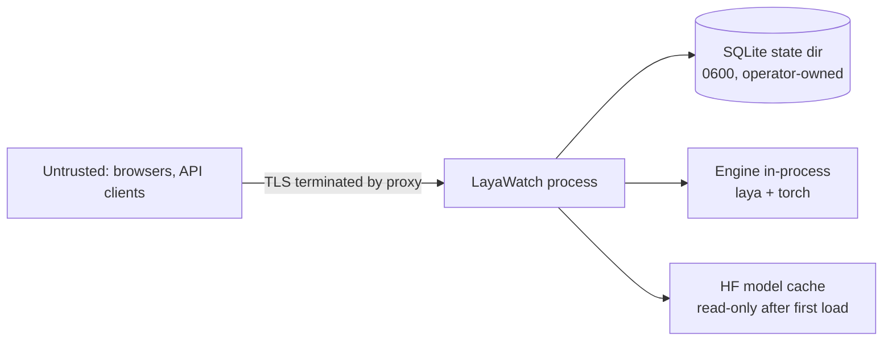

# LayaWatch security model

Version: 0.1 (2026-09-22)

## 1. Trust boundaries

- LayaWatch binds `127.0.0.1` by default. Exposing it is an explicit operator decision, made through a
  reverse proxy that terminates TLS.
- The process is the security boundary: it holds model weights, credentials and audit history. It is
  never run as root in a container, and it never writes outside `LAYA_STATE_DIR` and the HF cache.
- There is no outbound network dependency after model download. The only egress is Hugging Face model
  fetching when a checkpoint is not cached.

## 2. Users, roles, permissions

| Action | owner | admin | viewer |
|---|---|---|---|
| View traces, metrics, logs, models, keys list | yes | yes | yes |
| Run playground, delete a trace, edit tags, submit scores | yes | yes | no |
| Create, rotate, revoke API keys, arm key auth | yes | yes | no |
| Load and unload models | yes | yes | no |
| Update settings (retention, sampling, capture) | yes | yes | no |
| View audit log | yes | yes | no |
| Create, edit, delete users, revoke sessions | yes | no | no |
| Toggle payload capture | yes | no | no |

Invariants enforced in code, not just in the UI:

1. The last enabled `owner` can never be deleted, demoted or disabled.
2. A user cannot change their own role or delete themselves.
3. A role check failure returns `403` and writes an audit entry with `result = denied`.
4. Every `/api/v1` mutation passes through one permission table; no handler checks roles ad hoc.

## 3. Authentication

### 3.1 Passwords

- Hashing: `hashlib.scrypt`, `n=2**14, r=8, p=1, dklen=32`, 16-byte random salt, stored as
  `scrypt$n$r$p$salt_b64$hash_b64`. Verification uses `hmac.compare_digest`.
- Policy: minimum 12 characters, must not appear in the built-in top-10k list shipped with the repo,
  rejected if it equals the email local part. No composition rules, no forced rotation.
- Change requires the current password. Owner-created users get `must_change = 1` and are forced to
  set a password before any other action.

### 3.2 Sessions

- Cookie `lw_session`: opaque 32-byte random token, `HttpOnly`, `SameSite=Lax`, `Path=/`,
  `Secure` when the request arrived over TLS (`X-Forwarded-Proto: https`).
- Storage: only the SHA-256 of the token is stored in `sessions`. Lookup is by hash.
- TTL 30 days (`LAYWATCH_SESSION_TTL`), sliding `last_seen`, absolute expiry enforced.
- Rotation: the session id rotates on login and on privilege change; password change revokes every
  other session for that user.
- CSRF: double-submit token in `lw_csrf` (readable) plus `X-CSRF-Token` header on every mutating
  request from a browser session. Missing or mismatched token is `403`.
- Logout revokes the current session; `DELETE /api/v1/sessions` revokes all others.

### 3.3 API keys (engine clients)

- Format `lay_` + 32 base62 chars, generated with `secrets.token_urlsafe`.
- At rest: `HMAC-SHA256(pepper, secret)` where the pepper lives in `LAYA_STATE_DIR/secret.key`
  (0600, generated on first start). Plaintext is shown exactly once and never stored or logged.
- Comparison uses `hmac.compare_digest`. Lookup is by the 8-char prefix, then constant-time verify.
- Rotation creates a new secret for the same key id and keeps the old one valid for a grace window of
  5 minutes (both hashes stored during the window) so clients can roll without downtime.
- `request_count` and `last_used` are updated in the writer batch, never per request transaction.
- Arming key auth requires at least one active key; disarming is audited.

## 4. Rate limits

Rate limiting is a managed product feature, specified in full in
[rate-limiting.md](rate-limiting.md). This section states only the security-relevant summary.

| Surface | Default | Scope | Response |
|---|---|---|---|
| `POST /api/v1/auth/login` | 5 per 15 min, then exponential backoff to 15 min | ip + email | `429` with `Retry-After`, audit `auth.login_blocked` |
| `/api/v1/*` mutations | 60 per minute | session | `429` |
| `POST /api/v1/playground/run` | 30 per minute | session | `429` |
| `POST /predict`, `POST /route` | per key: unlimited by default, per IP: 600/min | api key, ip | `429` with `RateLimit-*` headers |
| Concurrent forward passes | 4 queued, 16 hard bound | process | `429 engine_saturated` |
| SSE connections | 5 per session | session | oldest connection closed |

Buckets are token buckets in memory, keyed by subject, swept every minute; they reset on restart,
which is documented and acceptable for a single-process deployment. Policy is editable at runtime by
`owner` and `admin`, every change is audited (`ratelimit.updated`), and throttled requests are recorded
as traces with `status = 429` so abuse is visible in the Metrics view rather than invisible.

## 5. Audit log

Append-only, never updated or deleted through the API. Fields: `ts`, `actor_id`, `actor`, `action`,
`target`, `result`, `meta`. Covered actions are listed in `docs/api-reference.md` section 13. Audit
writes happen in the same transaction as the action they describe, so an action cannot succeed
without its record. Login failures record the attempted email and the ip, never the password.

## 6. Threat model

| Threat | Vector | Mitigation |
|---|---|---|
| Credential stuffing on the console | login endpoint | scrypt, rate limit per ip+email, audit, no user enumeration (same response for unknown email and wrong password) |
| Stolen session cookie | XSS or shared machine | HttpOnly, SameSite=Lax, short-lived optional TTL, revoke-all, no secrets in the DOM after first reveal |
| CSRF on mutations | cross-site form post | double-submit token, SameSite=Lax, JSON-only content type requirement |
| API key leakage | logs, screenshots, repos | hash at rest, prefix-only listing, shown once, rotation with grace window, audit |
| Payload PII in the database | trace capture | capture off by default, redaction list, truncation, 24 h payload retention, owner-only toggle |
| Malicious or accidental exposure | binding to `0.0.0.0` | loopback default, docs require a TLS proxy, `X-Forwarded-Proto` awareness, banner warning when bound publicly without TLS |
| Denial of service by large bodies | `/predict` | `LAYWATCH_MAX_BODY` 4 MiB, early `Content-Length` rejection, socket timeout |
| Resource exhaustion by model loading | `/api/v1/models/load` | one load at a time, RAM guard (`available` memory check before load), admin+ only, audit |
| Log injection | client-supplied fields in logs | control characters stripped, message length capped, structured fields escaped |
| SQL injection | filters | every query is parameterized; filters are validated against an allowlist of columns |
| Path traversal on static serving | `/` handler | resolved path must stay inside `web/out`, no symlink escape, explicit extension allowlist |
| Supply chain | dependencies | runtime dependencies limited to FastAPI, uvicorn and httpx (declared in `pyproject.toml`); dev dependencies pinned in `package-lock.json` and `requirements-dev.txt` |

## 7. Data at rest and privacy

- `LAYA_STATE_DIR` holds `state.sqlite3`, `secret.key`, optional captured payloads and the legacy
  `api_keys.json.imported`. Permissions: directory `0700`, files `0600`, enforced at startup with a
  warning (not a failure) when the operator's umask prevents it.
- No encryption at rest in v0.1: documented explicitly, with the recommendation to place the state
  directory on an encrypted volume. SQLCipher is deliberately not a dependency.
- Model cache and state directory are the only paths that need backup.
- Backups contain password hashes and audit history: treat them as secrets, and use the documented
  `VACUUM INTO` method rather than copying a live WAL file.

## 8. Hardening checklist (Phase 8 release gate)

1. Bind loopback by default, verified by an integration test.
2. `secret.key` generated 0600, never logged, verified by test.
3. Login rate limit and lockout backoff verified by test.
4. Session rotation on login and on password change verified by test.
5. CSRF rejection verified by test (mutation without header returns 403).
6. Last-owner protection verified by test (delete and demote attempts fail).
7. API key plaintext absent from database, logs and API responses, verified by grep test.
8. Payload capture off by default verified by test; redaction verified with a fixture containing
   `email`, `authorization`, `password`.
9. Static path traversal attempts (`../`, encoded, symlink) rejected, verified by test.
10. Container runs as a non-root user with a read-only root filesystem plus a writable volume.
11. `pip audit` / `npm audit` are run before a release; no high or critical findings at release.
12. Response headers: `X-Content-Type-Options: nosniff`, `Referrer-Policy: same-origin`,
    `Content-Security-Policy: default-src 'self'; img-src 'self' data:; style-src 'self' 'unsafe-inline'`
    (inline styles are required by the token approach; scripts are not inlined in the export).
