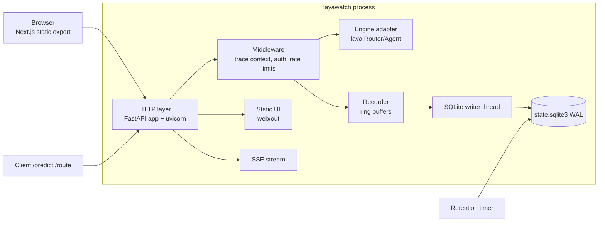
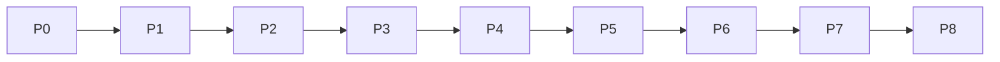

# LayaWatch master plan

Status: draft for approval
Version: 0.2
Date: 2026-09-22
Owner: TBD (repo owner)

## 1. Vision

LayaWatch is the self-hosted console that makes a local laya deployment observable and operable:
every decision request becomes a trace with spans, every trace feeds metrics and logs, and the
operator gets model management, key management, rate limit management, a playground and user accounts
in one process that costs almost nothing to run.

Product name: **LayaWatch**. Origin repository: `https://github.com/BLANCO-11/LayaWatch`.

## 2. Goals

1. Trace-level observability of `/predict` and `/route` with a span vocabulary that explains latency
   and rejections (auth, body, lang detect, route decide, queue wait, model load, forward, serialize).
2. Metrics and logs derived from the same recorder, with rollups cheap enough for a laptop.
3. Operations surface: model load/unload, API keys with rotation, rate limit policy management,
   playground, settings.
4. Admin login with real user accounts, roles and an audit trail.
5. Self-hosting: one Python process, one SQLite file, one volume, one container image. No Node at
   runtime, no external services, no telemetry egress.
6. UI/UX built on the approved mock and a written component language (`docs/design-language.md`).
7. Measured performance: budgets in `docs/performance.md` are gates, not aspirations.

## 3. Non-goals

- Not a general-purpose APM and not a distributed tracer. LayaWatch observes the process it runs in.
- Not a model trainer, evaluator platform or data-labeling tool. Scores exist as a data model hook
  (playground and API sources) but no annotation UI in v0.1.
- Not multi-tenant. One deployment serves one team; users share one dataset.
- No cloud dependency, no hosted control plane, no phone-home.
- No Postgres, Redis or message broker in the default topology. Rate limit buckets are in-process by
  design (see `docs/rate-limiting.md` section 10).

## 4. Constraints

| Constraint | Value | Rationale |
|---|---|---|
| Runtime deps added by LayaWatch | FastAPI, uvicorn, httpx (declared in `pyproject.toml`) | three small wheels; keeps the venv that already carries torch/transformers stable |
| Frontend at runtime | static files only | Next.js is a build-time dependency (`output: "export"`) |
| Python | 3.12 | engine compatibility |
| Storage | SQLite (WAL), single file under `LAYA_STATE_DIR` | backup = copy one directory |
| Bind address | `127.0.0.1` by default | exposure is a deliberate reverse-proxy decision |
| Engine dependency | `laya` package (torch CPU), models from HF cache | already provisioned locally |

### Resource budgets (enforced at the Phase 8 gate, tracked from Phase 7)

| Budget | Target | Measurement |
|---|---|---|
| LayaWatch RSS overhead (excluding model weights) | <= 120 MB | `/proc/self/status` VmRSS delta after warmup |
| LayaWatch disk (excluding HF model cache) | <= 200 MB | `du -sh` on state dir at 10k traces |
| Production image delta over `python:3.12-slim` + torch | <= 50 MB | image size diff |
| Idle CPU | < 2 % | `top` 60 s average with UI closed |
| Cold start to first served request | <= 3 s plus model load | startup log timestamps |
| Recording overhead on engine latency | <= 3 ms p95 | `scripts/bench.py overhead` |

## 5. Architecture summary

Single process, four moving parts:

Decisions that shape everything else (full text in `docs/architecture.md`):

- **D-001** Superseded 2026-09-22: the HTTP layer is a FastAPI app factory (`layawatch/app.py`)
  served by the uvicorn runner (`layawatch/http/server.py`); the original zero-dependency stdlib
  server choice is retired. FastAPI, uvicorn and httpx are the only added runtime dependencies.
- **D-002** Next.js static export served by the same Python process. Node is build-time only.
- **D-003** SQLite WAL with a single writer thread, batched inserts, and rollup tables for charts.
- **D-004** Observability model shaped after Langfuse (trace, observation, score) but trimmed to
  what a single-process engine can produce.
- **D-005** Payload capture is off by default (PII safety); summaries and sizes are always recorded.
- **D-006** Legacy `serve.py` endpoints stay working during migration and are removed at Phase 8.
- **D-007** UI is built from a written component language; the approved mock is the visual baseline.
- **D-008** Rate limiting is a managed product feature: runtime-editable policy, per-key overrides,
  live bucket usage, audited changes, throttled requests recorded as traces
  (`docs/rate-limiting.md`).
- **D-009** Optimization is measurement-gated: baseline first, then apply catalog groups, keep only
  measured wins, record before/after numbers (`docs/performance.md`).
- **D-010** Optimization is its own phase (7) before packaging and release (8), so budgets are proven
  on the final code rather than the scaffold.
- **D-011** Frontend budget: first-load JS <= 150 KB gzip per route and `web/out` <= 3 MB, enforced by
  `scripts/web_check.py` in CI (proposed in phase 4).
- **D-012** Theme resolution runs as a blocking external `web/public/theme-init.js` instead of an
  inline script, so the CSP in `docs/security.md` section 8.12 holds without `unsafe-inline`
  (proposed in phase 4).
- **D-013** `DELETE /api/v1/traces?since=&until=` adds audited bulk range deletion for the Settings
  danger zone, because a client-side loop would trip the 60/min session mutation limit (proposed in
  phase 6).
- **D-014** `GET /api/v1/models` gains a per-model `stats` block (`size_bytes`, `load_ms`,
  `requests_24h`, `p50_ms`) because no endpoint exposed checkpoint size or per-model load time
  (proposed in phase 6).

## 6. Phase index

| Phase | Title | Deliverable | Depends on |
|---|---|---|---|
| 0 | Foundation and scaffolding | package skeleton, config, SQLite schema + migrations, static serving, design tokens ported, CI, tests baseline | none |
| 1 | Instrumentation and storage | recorder, span vocabulary, writer, rollups, retention, log capture, legacy state migration | 0 |
| 2 | Read API and streaming | REST resources, filters, pagination, SSE, static UI serving, legacy shims | 1 |
| 3 | Auth, users, keys and rate limits | login/logout, users, roles, sessions, CSRF, audit log, API keys + rotation, managed rate limiting | 2 |
| 4 | Frontend foundation | Next.js app, design-system components, app shell, theming, login and setup UI, states, a11y baseline | 3 |
| 5 | Observability views | Overview, Traces + waterfall, Metrics, Logs against live data | 4 |
| 6 | Operate and admin views | Playground, Checkpoints, API keys, Users, Audit, Settings (rate limits, retention, capture) | 5 |
| 7 | Performance and optimization | measured optimization pass, budgets met, regression guards in CI | 6 |
| 8 | Packaging, self-host and release | Docker, compose, systemd, backup/restore, budget gate, security review, e2e, v0.1.0 | 7 |

Phases are strictly ordered: each one ends with a gate that the next depends on. No phase starts
before the previous gate passes.

## 7. Milestones

| Milestone | Definition | Phase |
|---|---|---|
| M1 Skeleton runs | `make dev` serves the API and a static UI shell, tests green | 0 |
| M2 A predict is traceable | one `/predict` produces a trace with 8+ spans visible in SQLite and via API | 1, 2 |
| M3 Access is real | login, roles, audit log, key rotation and rate limits working end to end | 3 |
| M4 UI parity with mock | shell, tokens, both themes and component catalog match the approved mock | 4 |
| M5 Full console | all eight views live against real data, limits managed from the UI | 5, 6 |
| M6 Optimized | every harness within budget, regression guards green in CI | 7 |
| M7 v0.1.0 | single image, documented install, budgets verified, security review closed | 8 |

## 8. Gates (definition of done per phase)

A phase is done only when all of the following hold:

1. Every acceptance criterion in its `plan.md` is verified by an observed command or a UI check.
2. `evidence.md` lists the commands run and the observed results, including failures that were fixed.
3. `issues.md` has no open `blocker` or `major` entries; deferred items are labeled `deferred`.
4. `decisions.md` records every choice that changed the design, with alternatives and consequences.
5. `outcome.md` states what shipped, what did not, and what the next phase inherits.
6. The full test suite passes (`make test`) and the smoke path for that phase runs clean.

## 9. Risk register

| Id | Risk | Impact | Mitigation |
|---|---|---|---|
| R-01 | Recording every request inflates latency or memory | slow engine, OOM | ring buffers with fixed caps, batched writes, `LAYA_TRACE_SAMPLE`, `LAYWATCH_RECORD=0` lever, budget check in P1 and P7 |
| R-02 | torch CPU inference serialized by `_predict_lock` distorts queue metrics | misleading charts | measure queue wait explicitly as a span, document single-worker semantics in the UI |
| R-03 | Payload capture leaks PII into SQLite | compliance | capture off by default, truncation + redaction list, documented in security.md |
| R-04 | FastAPI/uvicorn upgrade changes wire behavior | subtle HTTP regressions | wire behavior (411/413 guards, gzip, `on_sent` after body send) concentrated in the app bridge `layawatch/app.py`; version floors in `pyproject.toml` |
| R-05 | Static export cannot do server-side auth redirects | auth UX | login is an API call, session cookie, client-side guard plus server-side 401 on every API call |
| R-06 | Model load/unload from the UI can thrash memory | OOM | single action at a time, confirm dialog, RAM guard, audit entry |
| R-07 | Vendored engine drift (`laya` in `.venv`, not in repo) | unreproducible builds | pin engine version in docs and lock file, document install path in operations.md |
| R-08 | Scope creep into a full eval platform | schedule | non-goals section is binding; scores stay a data model hook in v0.1 |
| R-09 | Rate limits block legitimate clients or are bypassed behind a proxy | outages or abuse | `RateLimit-*` headers, loopback exemption, live usage panel, per-key overrides, audited resets; trust `X-Forwarded-For` only when `LAYWATCH_TRUST_PROXY=1` (`docs/rate-limiting.md`) |
| R-10 | An optimization regresses correctness or durability | silent data loss | each change must show before/after numbers and pass the full suite; revert anything unmeasured (`docs/performance.md` section 6) |
| R-11 | Optimization work expands without bound | schedule | catalog is closed; new ideas go to a backlog section in the phase outcome, not into Phase 7 |

## 10. Open questions (need owner decision)

| Id | Question | Default if unanswered |
|---|---|---|
| Q-01 | License (MIT vs Apache-2.0) | MIT |
| Q-02 | Should the `laya` engine be vendored into this repo or stay an external pinned dependency? | external, pinned |
| Q-03 | Single-user mode (no login) as a config option, or always require accounts? | always accounts, with first-run owner bootstrap |
| Q-04 | Ship a Caddy reverse proxy in compose by default? | optional compose profile |
| Q-05 | Retain raw payloads at all, even opt-in? | opt-in only, truncated, 24 h |
| Q-06 | Default per-key engine limit: unlimited or a sane ceiling (for example 600/min)? | unlimited (`0`), IP guard active |

## 11. Working conventions

- Phase directories: `plan/phase-N-slug/` containing `plan.md`, `evidence.md`, `issues.md`,
  `decisions.md`, `outcome.md`.
- Status vocabulary: `planned`, `in progress`, `blocked`, `done`, `deferred`.
- Issue severity: `blocker`, `major`, `minor`, `nit`.
- Decision ids are global (`D-0NN`) and never reused; phase-local issues use `P<N>-I<NN>`.
- Evidence entries are commands plus observed output, never "looks fine".
- Docs are updated in the same change that alters behavior; a stale doc is a defect.
